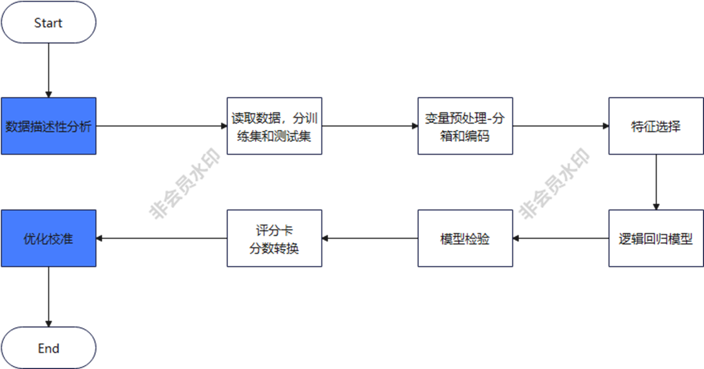
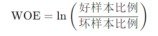
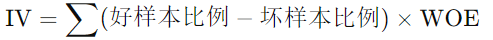

# 信用模型建立与数据库数据分析
## 0.0 最初的起点：发现问题，问题场景
数据处理一切的目标通常都是解决某一个问题。所以确认问题的内容细节很重要\
其次，理解如何建立信用评分模型也很重要（下图展示了Eric导师提供的步骤图）：

**因为这是学习项目，数据都经过筛选，处理和精简了。所以帮我们省去了最复杂的步骤**
- 通常数据分析70%-80%的时间都会在这一步，因为如果数据是有问题的，最后的结果会大打折扣。数据的准确性和完整度非常重要!

***
## 1.1 数据收集
发现问题后，当然要开始先收集数据。可以是自己收集，也可以是合并第三方（公开）的信息。
**但是在收集前，要确保你明确哪些数据是会帮助你分析和解决这个问题的**

## 1.2 预数据处理
### 意义
确保数据完整、无缺失值和异常值。预处理数据是进行任何分析的基础。
1. 收集原始数据(1.1)
2. 处理缺失值和异常值
3. 标准化数据格式，例如分类：1，2，3各代表这个变量中某种类型

## 1.3 数据描述性分析
### 意义
这会帮助你先是更加完整的理解之前所收到的数据和你的问题目标有什么关系。
确定哪些变量对分析目标有影响，忽略无关或冗余的变量，专注于有用的变量，简化模型。
主要目标是后期建立模型前的**变量筛选-Feature Selection**

### 步骤
1. 相关性分析：检查变量之间的相关性，**去除高度相关的变量**
2. 特征重要性排序：使用算法（如随机森林）评估每个特征的重要性，筛选出重要指标。

***
## 2.1 分箱（Binning）
### 意义
将连续变量离散化，使得模型更易于解释，同时也可以减少数据噪声。换句话讲，将连续性的变量数据分成几个类别，例如年龄就是可以0-20岁，20-40岁等
- **分箱后的作用**
    - **提高模型解释性**：将连续变量转化为离散变量，可以更容易地解释模型输出。（continues -> discrete）
    - **减少数据噪声**：分箱可以平滑数据中的小波动，减少噪声对模型的影响,例如数据里会偶尔出现特别例。
    - **处理非线性关系**：分箱有助于捕捉变量与目标变量之间的非线性关系。而不是数据库里每一条变量的值都分析。
### 步骤
  - 使用等频、等宽或最佳分箱方法将连续变量分成不同的区间

## 2.2 WOE（Weight of Evidence）值计算

WOE值简单来说，就是在分箱后，一个箱子里好数据和坏数据的比例。例如在20-40岁中，15个有贷款逾期未还的现象，那他们就是坏数据，在数据表上通常会是1。
这样当我们可以用WOE值来当作一个个箱子的值进行下一步模型建立的话，会帮助我们更快速也更准确提升模型并提高模型解释性，换句话说，模型会更有代表性。
### 意义
分箱完成以后，就可以到下一步计算WOE值等数据情况，这可以帮助我们锁定有用的特征去建立模型
将分类变量转化为连续变量（通过将连续的原始数据分类，再赋值转换成连续性的数字），保持信息量的同时，使变量对模型更加友好。话句话说，就是把一个个数据编程一堆一堆的数据团，进行这之上的模型建立，用WOE值而不是最开始的相关值。
### 步骤
1. 计算每个分箱中好坏样本的比例
2. 计算每个分箱的WOE值（在代码里可以直接运用，不需要自己编写）

你可以用更具解释性的WOE值替换原来的连续变量，并使用这些新变量进行建模，提高模型的预测能力和稳定性。

## 2.2.1 IV（Information Value）值计算

### 意义
衡量每个特征变量的预测能力，帮助进一步筛选重要特征。
### 步骤
1. 根据WOE值计算每个特征的IV值（可以直接套用）

特征选择：IV值用于衡量特征的预测能力。IV值越高，说明该特征对目标变量的区分能力越强。 通常：
- IV < 0.02：无预测力
- 0.02 ≤ IV < 0.1：预测力弱 
- 0.1 ≤ IV < 0.3：预测力中等 
- IV ≥ 0.3：预测力强

变量筛选：根据IV值筛选出对预测最有用的特征，从而简化模型，去除无关或冗余的变量。

## 2.2.2 AUC值计算
在我的步骤里，我为了确保我选择的分箱数量是最优的。我运用了AUC去找到最好的分享数量，去确保后面建造的模型更准确。
AUC (Area Under the ROC Curve) 是评估分类模型性能的一个常用指标。ROC曲线描绘了模型的真正率（True Positive Rate）与假正率（False Positive Rate）之间的关系，而AUC则是该曲线下的面积。\

AUC的取值范围是0到1，数值越大表示模型的性能越好。具体解释如下：

- AUC = 1：完美分类器，模型能够完美区分正负样本。 
- 0.5 < AUC < 1：模型性能越好，接近1表示模型效果越好。 
- AUC = 0.5：模型没有分类能力，表现如同随机猜测。 
- AUC < 0.5：模型表现很差，甚至比随机猜测还差。

经过这一步，我能用最优的分箱数量，进行WOE值和IV值计算。这样可以提高对后期模型建立与训练的准确率。根据导师提供的资料，我用逻辑回归模型在这一步进行筛选，因为后期模型建立还是会用到逻辑回归按照导师的示例图。
这样
### 通过以上步骤，你能够从最初的预数据处理、分箱、计算WOE和IV，到最终选择IV值最高的特征进行建模。这样的方法可以帮助你建立一个更加稳定、解释性更强的预测模型。
***
## ***实际例子*** ： 德国信用数据库分析-指标筛选
因为数据已经处理过，我选择了先选择对目标变量有影响力的变量，然后在此之上进行一步步筛选到最后五个。用这五个
- 根据图标可以分析出对目标变量最后影响力的几个变量
- 我设立了一个量，用来寻找n个对目标变量有影响的变量用于后期分箱

***
## 3.1 模型构建与验证
### 意义
建立预测模型并验证其性能，以确保模型的准确性和稳定性。
### 步骤
1. 选择适当的算法（如逻辑回归、决策树等）
2. 训练模型
3. 使用交叉验证或独立测试集评估模型性能

这里我选择了几个常见模型：

建立逻辑回归模型 (Logistic Regression)
model_LR = LogisticRegression(max_iter=10000, C=1.0, penalty='l2', solver='lbfgs')

建立决策树模型 (Decision Tree)
model_DT = DecisionTreeClassifier(random_state=42)

建立随机森林模型 (Random Forest)
model_RF = RandomForestClassifier(random_state=42)

建立梯度提升机模型 (Gradient Boosting Machine, GBM)
model_GBM = GradientBoostingClassifier(random_state=42)

建立支持向量机模型 (Support Vector Machine, SVM)
model_SVC = SVC(probability=True, random_state=42)

- **通过训练和评估最后的准确率等结果，我们可以找到最适合的模型** 
### 以下是模拟中获得的结果：

### Model Performance Summary

#### Best Model: Logistic Regression

#### Performance Metrics

| Metric           | Value             |
|------------------|-------------------|
| Accuracy         | 0.8075            |
| AUC              | 0.8439583333333334|

#### Confusion Matrix

|        | Predicted Negative | Predicted Positive |
|--------|--------------------|--------------------|
| Actual Negative | 248                | 32                 |
| Actual Positive | 45                 | 75                 |

#### Classification Report

| Class | Precision | Recall | F1-Score | Support |
|-------|-----------|--------|----------|---------|
| 0     | 0.85      | 0.89   | 0.87     | 280     |
| 1     | 0.70      | 0.62   | 0.66     | 120     |

#### Overall Metrics

| Metric          | Value |
|-----------------|-------|
| Accuracy        | 0.81  |
| Macro Avg Precision | 0.77 |
| Macro Avg Recall | 0.76 |
| Macro Avg F1-Score | 0.76 |
| Weighted Avg Precision | 0.80 |
| Weighted Avg Recall | 0.81 |
| Weighted Avg F1-Score | 0.80 |
***
## 3.2.模型优化
### 意义
提高模型的预测准确性和稳定性。
### 步骤
1. 调整模型参数
2. 选择最优特征
3. 使用正则化方法防止过拟合

- 对于参数调整，我们可以在定义模型的时候修改
- 我在代码里用了集成学习，交叉验证等方法去提升模型
- 初次之外，我还尝试了模型堆叠（Stacking）
  - 但是在这里并没有很大的提升模型结果，详情可以看代码参看
  - 主要逻辑就是在第一次训练的模型之上运用结果再一次训练模型
    - 例如用StackingClassifier或者直接再一次套用模型

## 4.1.评分卡构建与信用评分计算
### 意义
将模型结果转化为评分，便于实际应用和解释。
### 步骤
1. 根据模型输出的概率或评分，将其映射到特定的评分区间
2. 构建评分卡

最后这里用我们的模型测试结果建立评分卡先，主要是用WOE值进行一些数学计算。
然后后期就可以用这个评分卡来计算最终分数。

