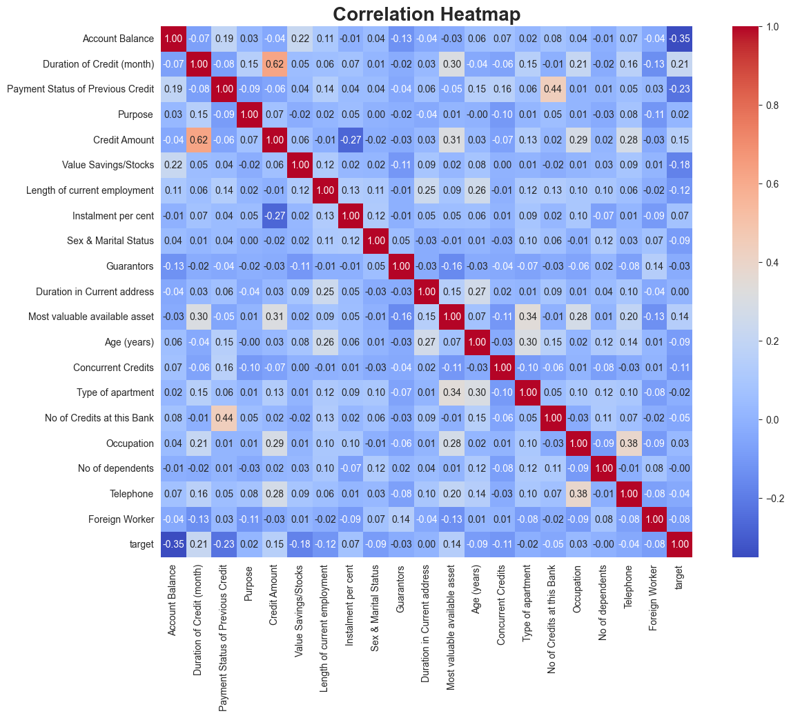
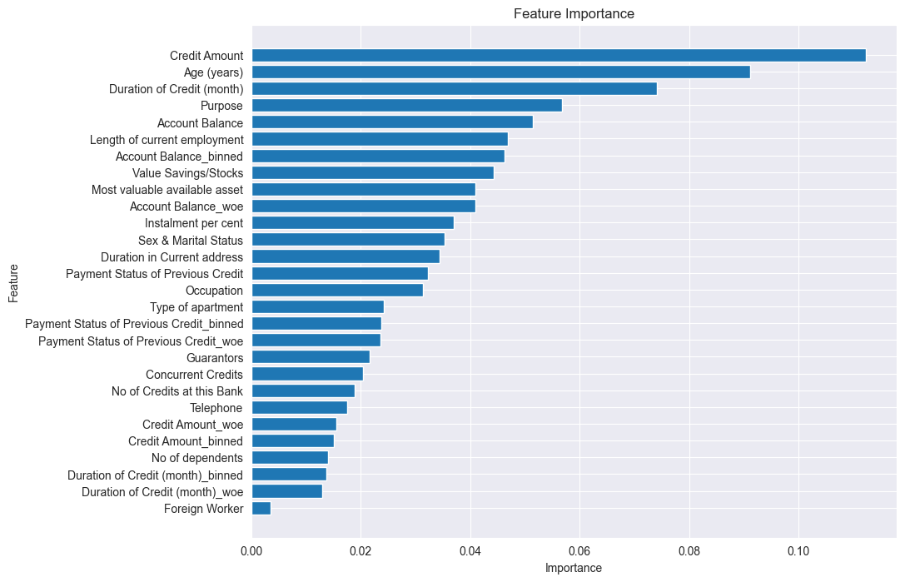

# 数据库数据分析
## 0.0 最初的起点：发现问题，问题场景
数据处理一切的目标通常都是解决某一个问题。所以确认问题的内容细节很重要。

## 1.1 数据收集
发现问题后，当然要开始先收集数据。可以是自己收集，也可以是合并第三方（公开）的信息。

**但是在收集前，要确保你明确哪些数据是会帮助你分析和解决这个问题的**

## 1.2 预数据处理
### 意义
确保数据完整、无缺失值和异常值。预处理数据是进行任何分析的基础。通常数据分析70%-80%的时间都会在这一步，因为如果数据是有问题的，最后的结果会大打折扣。数据的准确性和完整度非常重要!
### 步骤
1. 收集原始数据(1.1)
2. 处理缺失值和异常值
3. 标准化数据格式

## 1.3.指标筛选
### 意义
这会帮助你先是更加完整的理解之前所收到的数据和你的问题目标有什么关系。
确定哪些变量对分析目标有影响，忽略无关或冗余的变量，专注于有用的变量，简化模型。
主要目标是**变量筛选-Feature Selection**

### 步骤
1. 相关性分析：检查变量之间的相关性，**去除高度相关的变量**
2. 特征重要性排序：使用算法（如随机森林）评估每个特征的重要性，筛选出重要指标。

#### ***实际例子*** ： 德国信用数据库分析-指标筛选
- 根据图标可以分析出对目标变量最后影响力的几个变量
- 我设立了一个量，用来寻找n个对目标变量有影响的变量用于后期分箱

## 2.1.分箱（Binning）
### 意义
将连续变量离散化，使得模型更易于解释，同时也可以减少数据噪声。
### 步骤
1. 使用等频、等宽或最佳分箱方法将连续变量分成不同的区间

## 2.2 WOE（Weight of Evidence）值计算
### 意义
将分类变量转化为连续变量，保持信息量的同时，使变量对模型更加友好。
### 步骤
1. 计算每个分箱中好坏样本的比例
2. 计算每个分箱的WOE值

## 2.2.1 IV（Information Value）值计算
### 意义
衡量每个特征变量的预测能力，帮助进一步筛选重要特征。
### 步骤
1. 根据WOE值计算每个特征的IV值
2. 筛选出IV值较高的变量

你可以用更具解释性的WOE值替换原来的连续变量，并使用这些新变量进行建模，提高模型的预测能力和稳定性。

## 3.1 模型构建与验证
### 意义
建立预测模型并验证其性能，以确保模型的准确性和稳定性。
### 步骤
1. 选择适当的算法（如逻辑回归、决策树等）
2. 训练模型
3. 使用交叉验证或独立测试集评估模型性能

## 3.2.模型优化
### 意义
提高模型的预测准确性和稳定性。
### 步骤
1. 调整模型参数
2. 选择最优特征
3. 使用正则化方法防止过拟合

## 4.1.评分卡构建
### 意义
将模型结果转化为评分，便于实际应用和解释。
### 步骤
1. 根据模型输出的概率或评分，将其映射到特定的评分区间
2. 构建评分卡

## （5.模型监控与维护）
### 意义
确保模型在实际应用中的有效性和稳定性，及时发现并调整模型。
### 步骤
1. 定期监控模型表现
2. 更新模型以应对数据变化
